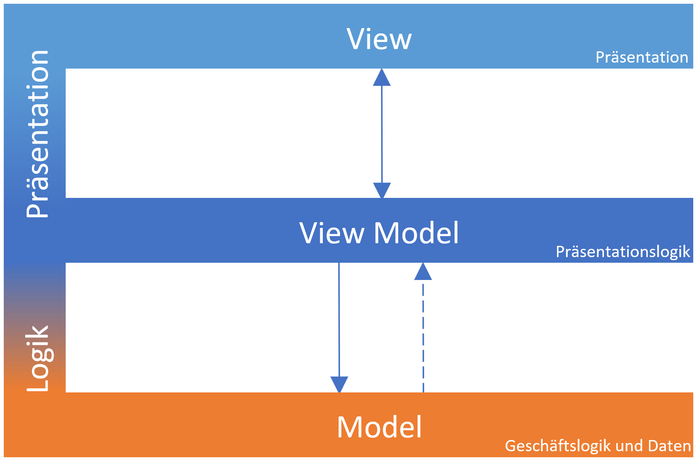

# Architektur der Anwendung
## Allgemeine Architektur
Die Darstellung der Anwendung und ihre Logik sind nach dem MVVM-Entwurfsmuster realisiert. Das MVVM-Entwurfsmuster steht für „Model – View – View-Model“ und sieht die folgende Architektur vor:

Die erste Komponente des MVVM-Modells ist die View. Diese enthält ausschließlich Code zur Darstellung der Anwendung und wird durch fxml-Dateien im Resources-Verzeichnis definiert. Die Views werden von den View-Models gesteuert. Ein View-Model bereitet die Anwendungsdaten auf. Die von der View angeregte Operationen werden vom Viewer-Model registriert und validiert. Dadurch erhält das View-Model die vom Nutzer eingegebenen Daten. Mithilfe dieser Daten greift das View-Model auf die Model-Schicht zu, die den Kern der Geschäftslogik abbildet. Die Model-Schicht ist sowohl für die Datenverarbeitung als auch Datenhaltung zuständig. Daher sind die ViewModels in diesem Projekt im Paket „ui“ finden, während sich die Anwendungslogik und Datenmodelle über die anderen Packages erstrecken.

## Aufbau des Projekts
Der Code dieser Anwendung unterteilt sich gemäß dem MVVM Muster in eine Darstellung (= View) im Verzeichnis "resources", den View-Models im Package "ui", sowie der Geschäftslogik und den Datenstrukturen (= Model) in den Packages "models", "parser" und "persistence".

Die UI dieses Projekts ist in JavaFX realisiert. Die fxml-Definitionen der Benutzeroberfläche sind im Verzeichnis "resources" der Maven-Projektstruktur zu finden. Ebenfalls in diesem Verzeichnis finden sich eine Liste internationaler Vornamen und deren Geschlecht im Unterverzeichnis "names", sowie ein CSS-Dokument zur Formatierung der Darstellung im Unterverzeichnis "styles".

Das Package "ui" hingegen enthält die vom MVVM-Entwurfsmuster verlangten View-Models. Des Weiteren findet sich hier die Klasse "Startup", die zum Starten der Anwendung und Laden der Hauptansicht dient. Im Subpackage "components" befinden sich mehrfach verwendete Komponenten der Benutzeroberfläche.

Im Package "persistence" wiederum finden sich die nötigen Schnittstellen und Datenstruktur, um die vom Benutzer konfigurierten Titel und Muster der Anreden zu persistieren. Hierzu wurden eine Klasse "ConfigFile" und "Configuration" definiert, die die Definition einer Konfigurationsdatei und Operationen auf diese, bzw. Zugriffe auf Konfigurationen erlauben. 

Das Package "parser" enthält die Klasse "InputParser". Diese ist das Kernelement der Geschäftslogik der Anwendung. Sie dient dazu, vom Benutzer eingegebene Anreden zu erkennen und unter Verwendung der vom Benutzer definierten Konfiguration, eine Briefanrede aus den extrahierten Informationen zu bilden.

Die für die Funktionalität der Anwendung nötigen Datenmodelle finden sich im Package models. Diese umfassen die Definition eines Kontakts in der Klasse "Contact", einer Konfiguration zur Verarbeitung einer Anrede in der Klasse "ContactPattern", sowie Klassen für die verfügbaren Geschlechter ("Genders") und Titel einer Person ("Title"). 

## Persistenz-Schicht
Zur Speicherung der Konfiguration wird im Verzeichnis des aktuell angemeldeten Benutzers ein Unterverzeichnis „Kontaktsplitter-Kings“ angelegt. Darin wird die Konfiguration gespeichert. Die Konfigurationsdatei wird im JSON-Format abgelegt. Ist keine Konfiguration vorhanden, so wird mit Start der Anwendung eine Standard-Konfiguration erzeugt.